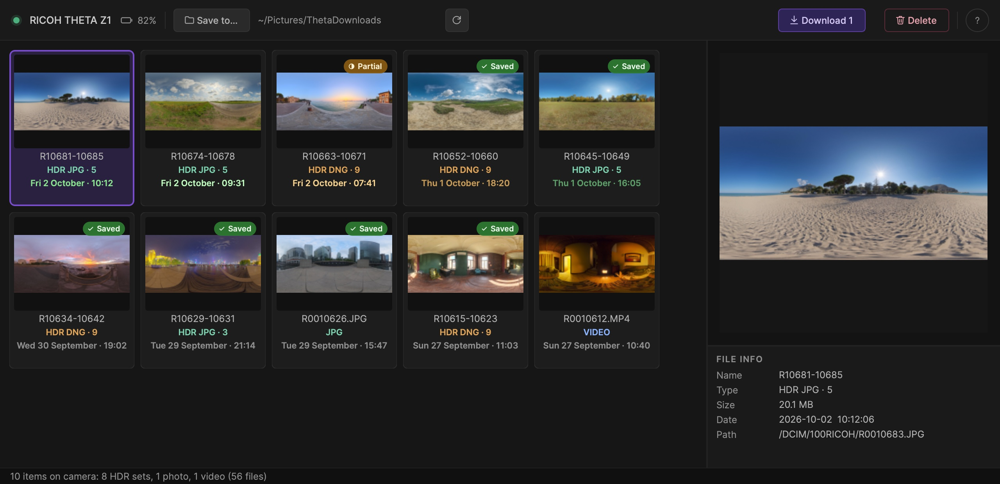

<p align="right"><b>English</b> · <a href="README_ES.md">Español</a></p>

# ThetaMacExplorer

Browse and download the photos and videos on a **RICOH THETA** camera from your Mac, over
USB. Made for HDRI work: each bracketed HDR sequence shows up as **one item**, previewed
with its middle exposure, and you can see at a glance which sets you already downloaded.



## Features

- **HDR sets as a single item.** A bracketed sequence (JPG or DNG) is grouped into one
  tile with its number of exposures, and is downloaded or deleted as a whole.
- **Preview and file info** for the selected item: name, type, size, date, resolution
  and path on the camera.
- **Know what you already have.** Items fully in your download folder are marked
  *Saved*; items with only some of their files are marked *Partial*.
- **Recent captures stand out.** A capture's date starts bright green (amber for DNG) and
  fades over 28 hours, so a fresh shoot is easy to find.
- **One folder per item.** Each item downloads into its own folder, named after its
  capture date and files, for example `HDRI_260402_R21381-21389_dng` for an HDR set.
- **Safe re-downloads.** If some files are already on disk you can skip them and get only
  what's missing (this completes a half-downloaded set) or replace the local copy.
- **Delete from the camera** with a confirmation that tells you how many files will go.
  Enter cancels; deleting always takes a click.
- **Battery level** of the camera in the toolbar.

## Requirements

- macOS 12 or later, on Apple Silicon or Intel.
- A RICOH THETA connected by USB and turned on. Tested with the **THETA Z1**.

## Install

1. Download `LGA_ThetaMacExplorer_Mac_v<version>.dmg` from
   [Releases](../../releases/latest).
2. Open it and drag **ThetaMacExplorer** onto **Applications**.
3. Open the app from Applications.

The app is not notarized by Apple. If macOS says it can't be opened or that it is
damaged, run this in Terminal and open it again:

```bash
sudo xattr -cr "/Applications/ThetaMacExplorer.app"
```

It only removes the quarantine flag that macOS adds to downloaded files, from this copy
of the app. It doesn't turn off Gatekeeper.

The first time, macOS may ask for permission to access the camera: the app needs it to
read the files on the THETA.

## Use

1. Connect the camera. Its photos and videos appear as tiles; HDR sequences appear as a
   single tile.
2. Choose where to save with **Save to…**.
3. Select one or more items and press **Download**, or **Delete** to remove them from the
   camera.

| Shortcut | Action |
|---|---|
| `⌘A` | Select all items |
| `Esc` | Clear the selection |
| `⌘?` | Open the Help |

The Help window also shows where the app keeps its files, and opens them in Finder:

- Settings: `~/Library/Application Support/LGA/ThetaMacExplorer/`
- Log: `~/Library/Logs/LGA/ThetaMacExplorer/debug.log`

## Build from source

Requires Xcode command line tools, CMake and Qt 6.5.3 at `~/Qt/6.5.3/macos`.

```bash
./compilar_dev.sh
```

builds a universal binary (arm64 + x86_64) in `build/` and launches it. `./deploy.sh`
builds the Release version and packages the DMG.

## Credits

The HDRIs in the screenshot are from [Poly Haven](https://polyhaven.com) (CC0): Spiaggia di
Mondello, Sunflowers, Venice Sunset, Golden Gate Hills, Autumn Park, The Sky Is On Fire,
Shanghai Bund, Canary Wharf, Fireplace and Photo Studio Loft Hall.

## Author

Developed by Lega Pugliese — [lega.com.ar](https://lega.com.ar)
